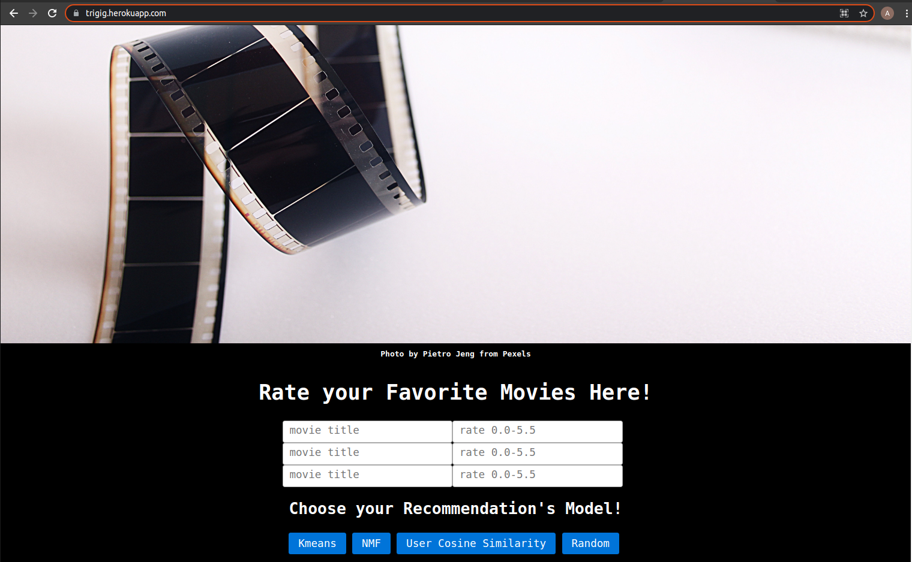

## Movie Recommendation Project
This project is my first unsupervised learning project and also the first project to use flask framework + HTML and CSS.

The recommender take 3 movie title and the rating to generate 5 recommendations according to the model selected.

### How to use?
run application.py

### Data
All models are trained on movielens dataset, educational version.
https://grouplens.org/datasets/movielens/

### Model Information

#### Kmean Clustering
Use sklearn Kmean.
#### Non-negative Matrix Factorization
Use sklearn NMF.
#### User Cosine Similarity
Use sklearn cosine similarity.
#### Random
Use numpy sample method.

### Web Application
For this first project I use python Flask framework with HTML and CSS.

### Deployment
Deployment on Heroku: https://trigig.herokuapp.com/
Please be noted that it can take up to 30 seconds to load the website on herokuapp

